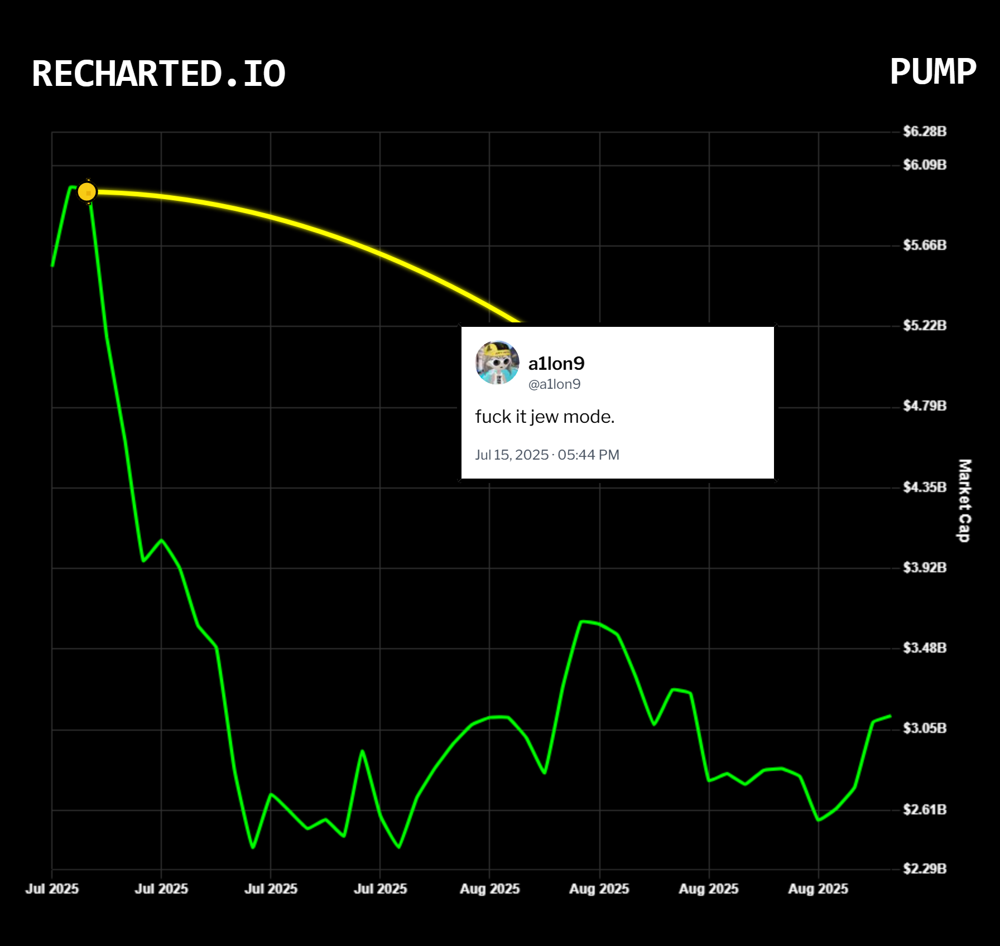

# recharted

> *the official ledger of bad takes, dump-tweets, and "trust me bro" exit liquidity*



[recharted.io](https://www.recharted.io/) bolts a tweet onto the chart at the exact second it was posted, so the world can see whether the KOL was a prophet or just providing exit liquidity to themselves.

If your call mooned: **flex it.** If your call rugged the bag holders: congrats, **you've been recharted.**

---

## what is this thing

You give it:

1. A tweet (the more confident, the better)
2. A token (DexScreener URL, contract address, or just type the ticker)
3. A timeframe

It gives you back:

- The chart of that token
- The tweet, pinned to the candle where the words came out of someone's mouth
- A downloadable PNG receipt

That's it. That's the whole bit. The chart doesn't lie, and now neither does the timeline.

---

## how to use the site

### 1. find a tweet worth roasting (or framing)

The classics:

- **"100x ez"** posted at the all-time high
- **"this is not financial advice but"** followed by an immediate -90%
- **"locked LP, doxxed dev, trust"** posted 2 hours before the rug
- Or — being fair — your own banger call that you want to immortalize

Copy the tweet URL. Works with `x.com` or `twitter.com`, photos and videos included.

### 2. paste it into recharted.io

- **Tweet URL** → paste it in the first box.
- **Token** → use the search box to look up a ticker on Ethereum, Solana, Base, BSC, Arbitrum, Optimism, Polygon, Avalanche, or Blast. You can also drop a DexScreener URL or raw contract address if you know what you're doing.
- **Timeframe** → pick how zoomed-in you want the receipt. Sub-minute windows for the truly nuclear pump-and-dump moments, days/weeks for the slow-bleed scams.

### 3. hit generate

The chart loads, the tweet snaps onto the timestamp where it was posted, and the bag-holder pain becomes visible to all.

### 4. drag the tweet (optional)

Don't like where the tweet sits? Drag it. Position it next to the candle that broke their wallet for maximum visual damage.

### 5. export the receipt

One click → PNG. Now it's a meme. Post it. Quote-tweet the original. Credit recharted.io if you're feeling generous, don't if you're not. The internet remembers either way.

---

## how being recharted works

You are recharted when **any** of the following happens:

- You posted "going long" and the chart immediately did a vertical handstand into the abyss.
- You shilled a coin that rugged within the same week.
- You called the bottom three bottoms ago.
- You called the top three tops ago.
- You posted "I told you" while quote-tweeting yourself, but the chart says you didn't, in fact, tell them.
- You said "trust me" out loud, on the timeline, with witnesses.

There is no appeal process. The candle is judge, jury, and exit liquidity.

---

## tech, briefly

- **Framework**: Next.js 15 (App Router), React 19, TypeScript
- **Charts**: Chart.js
- **Tweet data**: Twitter syndication via `/api/tweet`
- **Token search & OHLCV**: [Codex GraphQL](https://docs.codex.io/graphql) (multi-chain) — see [CODEX_INTEGRATION.md](./CODEX_INTEGRATION.md)
- **Solana sub-minute spike capture**: Helius swap aggregation via `/api/helius-swaps`
- **Native/major tokens** (BTC, ETH, SOL, BNB, USDC, USDT) are surfaced regardless of Codex ranking so they don't get drowned out by Solana memecoin tickers
- **Export**: html2canvas

API routes that actually exist:

| Route | Job |
|---|---|
| `GET /api/tweet?id=…` | Tweet payload (text, author, timestamp, photos) |
| `GET /api/token-search?q=…&chain=…` | Multi-chain token autocomplete with major-token presets |
| `GET /api/codex` | OHLCV bars + token metadata (needs `CODEX_API_KEY`) |
| `GET /api/helius-swaps` | Solana sub-minute candles built from raw swap transactions |

---

## run it locally

You wanted to look at the code. Respect.

### prerequisites

- Node.js 18+ (20+ recommended for Next 15)
- An API key from [Codex](https://www.codex.io/) — required for chart data
- *(optional)* A [Helius](https://www.helius.dev/) RPC URL if you want Solana sub-minute resolution

### install

```bash
git clone https://github.com/sp0oby/recharted.git
cd recharted
npm install
cp .env.example .env
# open .env and paste your CODEX_API_KEY (and HELIUS_RPC_URL if you have one)
npm run dev
```

Open [http://localhost:3000](http://localhost:3000) and start cooking.

### other scripts

```bash
npm run build    # production build
npm run start    # run production server after build
npm run lint     # Next ESLint
```

### project layout

| Path | What lives there |
|---|---|
| `app/page.tsx` | Main UI: inputs, generate flow, PNG export |
| `app/api/*` | Tweet, Codex, Helius, and token-search endpoints |
| `lib/api.ts` | Client fetch helpers, DexScreener URL parsing, Codex/Helius stacking |
| `components/trading-chart.tsx` | Chart.js rendering and timeframe windows |
| `components/tweet-overlay.tsx` | Draggable tweet card with timestamp anchoring |
| `components/token-search.tsx` | Multi-chain token autocomplete |

### deploy

Set `CODEX_API_KEY` (and optionally `HELIUS_RPC_URL`) in your Vercel project's Environment Variables, then push to `main`. That's it.

### git workflow

```bash
git pull origin main
# edit code…
git status
git add path/to/file
git commit -m "short imperative message"
git push origin main
```

Never commit `.env` — it's ignored. Use `npm` (the repo ships `package-lock.json`; `yarn.lock` is ignored).

---

## disclaimer

Not financial advice. Not legal advice. Not therapy. If you got recharted, that's between you and the candle. We just made the screenshot easier.
